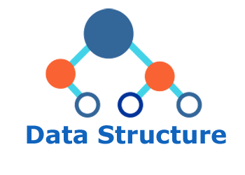

# Introduction

## 1. What is Data Structure?

### Data Structure(자료 구조)란?

- 자료 구조란 데이터에 편리하게 접근하고 조작하기 위한 데이터를 저장하거나 조직하는 방법
- 각 언어가 가진 자료구조의 종류와 그것에 대한 사용 방법을 익히는 것이 중요하지만, 무엇보다 각 자료구조의 본질과 컨셉을 이해하고 상황에 맞는 적절한 자료구조를 선택하는 것이 중요

## 2. Why Data Structure?

- 상황과 문맥에 맞게 데이터를 담을 수 있는 적절한 구조를 말한다.
- 데이터에 맞는 적절한 자료 구조를 사용하는 것은 전체 개발 시스템에 굉장히 큰 영향을 끼친다.

## 3. 자료 구조의 분류


- **Primitive Data Structure(단순 구조)**
: 프로그래밍에서 사용되는 기본 데이터 타입
- **None-Primitive Data Structure(비단순 구조)**
: 단순한 데이터를 저장하는 구조가 아니라 **여러 데이터를 목적에 맞게 효과적으로 저장하는 자료 구조**
    - **Linear Data Structure(선형 구조)**
    : 저장되는 자료의 전후 관계가 1:1 (ex. List, Stacks, Queues)
    - **Non-Linear Data Structure(비선형 구조)**
    : 데이터 항목 사이의 관계가 1:n 또는 n:m (ex. Graphs, Trees )

## 4. 일반적으로 가장 자주 사용 되는 자료 구조

- Array(Python에서는 List)
- Tuple
- Set
- Dictionary
- Stack & Queue
- Tree

# Array (List)

## 1. 정의 - Array(List)

- JS : Array
- Python : List
- 가장 기초적이고 단순하면서도 가장 자주 사용 되는 자료 구조

>💡 일반적으로 Python 에서는  Array 보다 일반 List 가 더 많이 사용 되고 대부분의 경우 큰 차이가 없음으로 그냥 List 를 사용하면 됩니다.
사실 Python 에서는 List 가 Array 라고 생각하고 써도 무방합니다. 다만 엄밀히 말하자면 Array 와 List 는 다릅니다. 기능적으로는 거의 동일하지만 메모리 효율면에서는 Array 가 유리합니다. 다만 사용하기에는 List 가 훨씬 편합니다. (Python 에서 Array 를 사용하려면 import Array 모듈을 import 해서 사용해야 합니다.)
>
p.s Python 에서 Array 와 List 의 차이에 대한 더 자세한 정보는 [이곳](https://stackoverflow.com/questions/176011/python-list-vs-array-when-to-use/176589#176589)(영문🇺🇸)을 참조하세요.

## 2. Array 특징

### 순차적으로 데이터를 저장하는 자료 구조

- 순차적(ordered)으로 데이터를 저장
- 자료구조에 저장된 데이터는 요소(element)라고 한다.
- 주로 서로 연결된 데이터들을 순차적으로 저장할 때 사용
- 순서가 상관 없더라도 서로 연결된 데이터들을 저장할 때 일반적으로 사용

### 기타 특징

- 삽입(insertion) 순서대로 저장 즉, 새로 삽입되는 요소는 array의 새로운 꼬리
- 이미 생성된 리스트도 수정 가능하다 (Mutable)
- 동일한 값도 여러번 삽입 가능
- Multi-dimentional Array (다중 차원 배열)
    - Array의 요소가 Array가 될 수 있다.
    - 이런 Array를 다중차원 배열이라고 하고 일반적으로 2차원 배열이 많이 사용
	

## 3. Array 내부 구조

- 배열의 가장 큰 특징은 순차적으로 데이터를 저장하는 것
- 순차적으로 번호를 지정할 수 있고 이 번호를 Index라고 한다.
- Index는 0부터 시작하며 마이너스(-) 부호를 가질 수 도 있다.
- 마이너스 Index는 맨 마지막 요소 부터 시작한다. (-1 : 맨 마지막 요소)

### 그렇다면 왜 Array가 순차적으로 데이터를 저장할 수 밖에 없을까요?

- 그건 바로 실제 메모리 상에서, 즉 물리적으로 데이터가 순차적으로 저장되기 때문입니다.
- 데이터에 순서가 있기 때문에
    - 1) index가 존재하며
    : 0부터 시작하는 index
    - 2) Indexing
    : Index를 사용해 특정 요소를 array(list)로 부터 읽어 들이는 것이 가능하고
    - 3) Slicing 
    : 요소의 특정 부분, 즉 n번째 index부터 m번째 index까지 따로 분리해 조작하는 것이 가능합니다.

## 4. 단점

### Removing or Adding Elements

- 순차적으로 담겨 있는 데이터 중 특정 위치에 있는 중간 요소가 삭제 되는 경우 삭제된 요소로 부터 뒤에 있는 모든 요소들을 앞으로 한 칸 씩 이동시켜주어야 한다.
- 즉, 배열에서 요소를 삭제하는 것은 다른 자료 구조에 비해 느릴 수 있다는 뜻
- 요소를 삭제하는 과정이 코드 상에서는 한 줄 이지만 실제 메모리 상에서 이루어지는 작업은 훨신 커진다.
- 특정 위치에 새롭게 요소가 추가되는 경우에도 마찬가지로 그 뒤의 요소들이 하나씩 밀려야 한다.
- 때문에 배열은 정보가 자주 삭제 되거나 추가되는 데이터를 담기에는 적절하지 않다.

### Array Resizing

- 배열은 처음 생성될 때 어느정도 메모리를 미리 할당 받으며 이를 pre-allocation이라 한다.
- 하지만 요소들이 처음 할당한 메모리 이상으로 많아진다면 resizing이 필요하다.
- 그리고 추가적으로 할당된 메모리 또한 순차적이어야 하며 이는 상대적으로 오래걸리는 명령이다.
    - 100개의 메모리 공간 다 차서 100개를 추가해야 되는 경우
        - 200개 크기의 메모리를 생성 후 > 기존 100개를 복사하고 > 그 다음 101번 부터 데이터가 순차적으로 추가됩니다.


- 그렇기 때문에 배열은 사이즈 예측이 잘 안 되는 데이터를 다루기에는 적절하지 않다.
- 사이즈가 급격하게 자주 늘어날 확률이 있는 데이터는 배열 말고 더 적합한 자료구조를 선택해야 한다

## 5. 언제 사용하면 좋을까요?

- 순차열적인 데이터를 저장할 때
    - ex) 주식 가격. 어제의 2만원과 오늘의 2만원이 다름 >>> 값보다는 순서가 중요한 데이터
- 다차원 데이터를 다룰 때 >>> Multi-dimensional Array
- 어떠한 특정 요소를 빠르게 읽어야 할 때 >> index를 통해 곧바로 읽을 수 있기 때문
- 데이터의 사이즈가 급변하게 자주 변하지 않을 때
- 요소가 자주 삭제 되거나 추가되지 않을 때

# Tuple

## 1. 정의 - Tuple

### Tuple 이란?

- LIst와 마찬가지로 데이터를 순차적으로 저장할 수 있는 순열 자료구조
- 한 번 정의되고 나면 수정 할 수 없다. (immutable)
- 2~3개 정도의 작은 수의 소규모 데이터를 저장할 때 많이 사용
- 함수에서 리턴 값을 한 개 이상 리턴 하고 싶을 때 자주 쓴다.

> **Tuple Is Not For Every Language!**
>
>Python 은 tuple이 있고 JavaScript는 없습니다. 그렇다고 `Python > JavaScript` 는 아닙니다! 다만 JavaScript에서는 tuple을 굳이 따로 안만든것 뿐입니다. Tuple은 list와 너무 비슷하기 때문에 굳이 제공하지 않는 언어도 많습니다. JavaScript에서는 그냥 array를 사용해도 상관없습니다.

## 2. 장점

- 간단한 값을 빨리 표현하고 싶을 때 많이 사용
- 예를 들면 함수에서 리턴 값을 한 개 이상 리턴하고 싶을 경우 (ex. 지도 좌표)
    - Tuple을 사용하는 경우와 class/object 를 사용하는 경우를 비교
        ```python
        # Tuple을 사용하는 경우
        [(1,2), (2,4)] // Array(List) 안의 Tuple
		
        # Tuple을 안 쓰는 경우에는 class를 생성해야함
        class cord:
        	def __init__(self, x, y):
        		self.x = x
        		self.y = y
        ```

## 3. 단점

- 데이터가 무슨 의미인지 명확하지 않다.
- 그렇기 때문에 소규모 데이터를 다루기에 적합하다.
- 이러한 단점을 극복하기 위해 Named Tuple이란 것도 Python에는 존재한다.

## 4. 언제 사용하면 좋을까?

- 배열을 쓰기에는 간단한 데이터들을 표현할 때 사용
    - 튜플이 배열보다 더 가볍고 메모리를 더 적게 먹는다.
